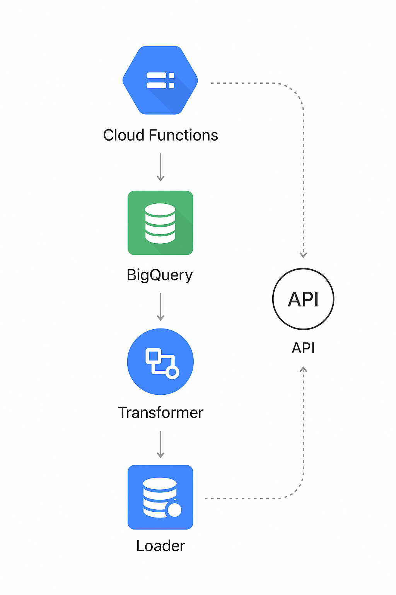

<h1 align="center">GCP Serverless ETL Pipeline</h1>

<p align="center">
  <strong>Pipeline ETL Serverless usando Google Cloud Functions, BigQuery e Python</strong><br>
  Extração de dados de API pública → Transformação com Pandas → Carga otimizada no BigQuery → Visualização no Looker Studio.
</p>

<p align="center">
  
  
  
  
</p>

---

# 📌 Sobre o Projeto

Este projeto implementa um **ETL totalmente Serverless na Google Cloud**, utilizando:

- **Google Cloud Functions** → execução sob demanda  
- **Requests + Retry** → extração resiliente  
- **Pandas** → transformação e limpeza  
- **BigQuery** → armazenamento analítico  
- **Looker Studio** → dashboards automatizados  
- **Logging estruturado (JSON)** → Cloud Logging  
- **Secret Manager** → gestão segura de credenciais

Ideal para portfólio de **Engenharia de Dados**, mostrando domínio prático do ecossistema GCP.

---

# 🏛️ Arquitetura

<p align="center">
  
</p>

Fluxo:
1. A Cloud Function é acionada (HTTP Trigger ou Scheduler).  
2. O Extractor consome uma API externa (ex: IBGE).  
3. O Transformer limpa/normaliza os dados com Pandas.  
4. O Loader envia para o BigQuery com create-if-not-exists.  
5. Os dados ficam disponíveis para dashboards no Looker Studio.  

---

# 🗂️ Estrutura do Projeto

```txt
.
├── README.md
├── estrutura.txt
├── requirements.txt
├── requirements-dev.txt
├── .gitignore

├── src/
│   ├── main.py
│   ├── cloud_function_handler.py
│   ├── core/
│   │   ├── config.py
│   │   ├── logger.py
│   │   └── exceptions.py
│   ├── etl/
│   │   ├── extractor.py
│   │   ├── transformer.py
│   │   └── loader.py
│   ├── services/
│   │   ├── api_service.py
│   │   ├── bigquery_service.py
│   │   └── secrets_service.py
│   ├── models/
│   │   ├── record_model.py
│   │   └── schema_definition.py
│   └── utils/
│       ├── validators.py
│       └── serializers.py

├── tests/
│   ├── test_extractor.py
│   ├── test_transformer.py
│   ├── test_loader.py
│   ├── test_bigquery_service.py
│   ├── test_api_service.py
│   └── test_cloud_handler.py

├── deploy/
│   ├── deploy.sh
│   ├── gcloud_instructions.md
│   └── architecture_diagram.png

└── docs/
    ├── architecture.md
    ├── bigquery_schema.md
    ├── api_reference.md
    └── looker_setup.md
```
---

## 🚀 Executando Localmente

1. Criar ambiente virtual
```bash
Copiar código
python -m venv venv
source venv/bin/activate  # Windows: venv\Scripts\activate
```
2. Instalar dependências
```bash
Copiar código
pip install -r requirements.txt
```
3. Criar arquivo .env
```env
Copiar código
GCP_PROJECT_ID=seu_projeto
BIGQUERY_DATASET=etl_dataset
BIGQUERY_TABLE=api_data
```
4. Executar o ETL
```bash
Copiar código
python src/main.py
```
---

## ☁️ Deploy no Google Cloud Functions

1. Autenticar
```bash
Copiar código
gcloud auth login
```
2. Usar script automático
```bash
Copiar código
bash deploy/deploy.sh
```
3. Deploy manual
```bash
Copiar código
gcloud functions deploy gcp_etl_pipeline \
  --runtime python311 \
  --trigger-http \
  --entry-point main \
  --region southamerica-east1 \
  --set-env-vars GCP_PROJECT_ID=xxx,BIGQUERY_DATASET=xxx,BIGQUERY_TABLE=xxx \
  --allow-unauthenticated
```

---

## 🧪 Testes
Os testes usam pytest + mocks.

Rodar:

```bash
Copiar código
pytest -v
Coverage:
```
```bash
Copiar código
pytest --cov=src
```

---

## 📊 Visualização no Looker Studio

Acesse: https://lookerstudio.google.com/

Crie uma nova fonte → BigQuery

Conecte ao dataset/tabela do pipeline

Publique seu dashboard

Documentação completa em: docs/looker_setup.md

---

## 🔒 Segurança

- Secrets nunca ficam no código
- Uso de Secret Manager (services/secrets_service.py)
- Logging em formato JSON (compatível com Cloud Logging)
- BigQuery com schema fixo (models/schema_definition.py)

---

## 🧭 Roadmap

- Criar CI/CD com GitHub Actions
- Implementar CDC com Debezium
- Criar segunda pipeline incremental
- Adicionar Airflow (Composer) como orquestrador opcional

---

## 🤝 Contribuição

Pull requests são bem-vindos!
Para contribuir:

```bash
Copiar código
git checkout -b feature/nome-da-feature
git commit -m "Descrição"
git push origin feature/nome-da-feature
```
---

# 📧 Contato

**Rui Francisco de Paula Inácio Diniz**

Engenheiro de Software • Analista de Dados
- LinkedIn: https://www.linkedin.com/in/
- GitHub: https://github.com/Dev-RuiDiniz

<h3 align="center">🔥 Serverless, escalável e pronto para produção!</h3> ```